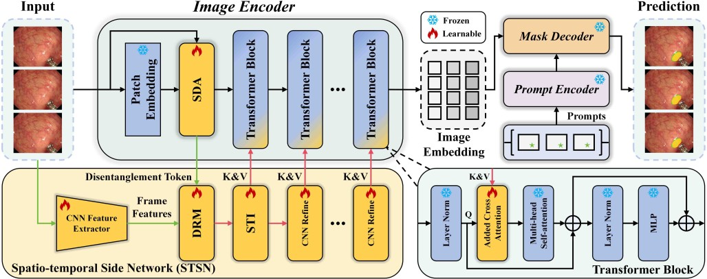

#  _VPSAM: Taming Segment Anything Model for Video Polyp Segmentation via Disentanglement and Spatio-temporal Side Network_
<!-- Official implementation of ECCV-24 paper: VPSAM: Taming Segment Anything Model for Video Polyp Segmentation via Disentanglement and Spatio-temporal Side Network. -->
### [Paper]()
> [**VPSAM: Taming Segment Anything Model for Video Polyp Segmentation via Disentanglement and Spatio-temporal Side Network**]()         
> [Zhixue Fang](), [Yuzhi Liu](), [Huisi Wu](), and [Jing Qin]() \
> **ECCV 2024**

Due to the confidentiality agreement in commercial cooperation, we only provide codes of core modules and the whole trainable models for the convenience of comparisons.



## Installation
```
conda create -n VPSAM python=3.8
conda activate VPSAM
pip install -r requirements.txt
```

## Reference
```bibtex
@inproceedings{fang2024vpsam,
  title={VPSAM: Taming Segment Anything Model for Video Polyp Segmentation via Disentanglement and Spatio-temporal Side Network},
  author={Zhixue Fang, Yuzhi Liu, Huisi Wu, and Jing Qin},
  booktitle={Proceedings of the ECCV Conference on European Conference on Computer Vision},
  year={2024}
}
```
